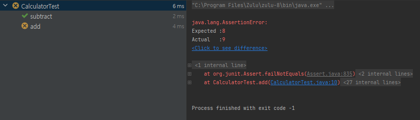

# 🐢 1장 : 첫 번째 양파 껍질 벗기기
> #### 이 책의 목표는 양파 껍질을 벗기듯이 한번에 한가지 지식을 깊게 습득하기보단 다양한 분야의 얕은 지식을 학습한 후 일정 수준이 되면 다음 단계로 가는 것이다.
- - -
## 1.1 📢 대한민국 IT 개발자 직군의 종류
- 웹 백엔드 개발자 : 우리 싸피생들의 대부분이 하고자 하는 직종, 자바, C#, 루비, 파이썬 등의 언어로 서버 쪽의 로직을 개발 하는 역할
- 웹 프론트엔드 개발자 : HTML/CSS, 자바스크립트를 주로 사용하며 디자이너와 협업을 하는 개발자
- 모바일 앱 개발자 : 안드로이드 개발자와 Objective-C 기반의 IOS 개발자가 이 범주에 속한다.
- 기타(Guitar 아님) : 시스템 프로그래머, 모바일 게임 개발자, 게임 서버 및 게임 클라이언트 개발자가 있다.
- 비 개발자 직군 : 중요한 비개발자 직군으로 DA, 시스템 엔지니어, 빅데이터 전문가가 있다.
- - -

## 1.2 📄 개발자들에게 유용한 웹사이트들 
> 소프트웨어 분야는 정말 빠르게 발전하고 있기 때문에 모든 지식을 알 수 없다. 빠르게 바뀌는 기술의 흐름을 파악하려면 온라인을 통해 지식을 습득하고 다양한 개발자와 소통해야한다. 
> 또한 모르는 문제는 검색을 통해 해결하자.
- - -
- [Google](https://google.com)
- [StackOverflow](https://stackoverflow.com)
- [GitHub](https://github.com)
- [SlideShare](https://slideshare.net)
- [trello](https://trello.com)
- [페이스북 그룹, 다양한 온라인 커뮤니티](https://ko-kr.facebook.com/)
- [MOOC 사이트들](https://www.codecademy.com/)
- - -
## 🔍 1.3 처음에 배워야 하는 것들
1. 맥 / 리눅스 사용법
2. 다양한 프로그래밍 언어
3. 내 전문분야에 대한 방향성 결정
- - -
## 🕵🏻‍♀️ 1.4 일단 시작해 보자 (JUST DO IT)
- [개인적으로 이거 작년에 들어봤을 때 강의가 굉장히 좋더라구요 여러분은 컴공이라 다 아는 내용이겠지만 한번쯤 보면 또 좋을거같아요](https://pll.harvard.edu/course/cs50-introduction-computer-science?delta=0)
- - -
## 👊🏻 1.5 본격적으로 웹 프로그래밍에 도전하기
- - -
### 1.5.1 온라인 강의를 통한 학습
- [생활코딩](https://opentutorials.org/course/1)
- [CodeAcademy](https://www.codecademy.com/)
- [w3 Schools](https://www.w3schools.com/)
- - -
### 1.5.2 책을 통한 학습
- [프로가 되기 위한 웹 기술 입문](https://wikibook.co.kr/web-text/)
- [열혈강의 자바 웹 개발 워크북](http://www.yes24.com/Product/Goods/13159413) -> [강의 동영상](https://www.youtube.com/watch?v=VxigsYs5hfc&list=PLTEeGHE5dNEO7fGBYIhZN59dcWufaCSok&ab_channel=%EC%97%84%EC%A7%84%EC%98%81)
- [SQL 첫걸음 : 하루 30분 36강으로 배우는 완전 초보의 SQL 따라잡기](https://www.hanbit.co.kr/store/books/look.php?p_code=B1374950226)

> **웹 애플리케이션 개발을 시작할 때 모르는 내용이 많더라도 일단 무엇인가 만드는 경험을 해볼 것을 추천한다.**
- - -
## 🥦 1.6 학습방법
1. 필요한 부분부터 흡수한다.
2. 대략적인 부분을 잡아서 조금씩 상세화 한다.
3. 끝에서부터 차례대로 베껴간다.
- - -
# 🗽 2장 문자열 계산기 구현을 통한 테스트와 리팩토링
- - -
### 2.1 main() 메소드를 활용한 테스트의 문제점
 다음과 같은 코드를 테스트하고자 하면 우린
 ```java
 public class Calculator {
    public int add(int i, int j) {
         return i + j;
     }
 
     public int subtract(int i, int j) {
         return i - j;
     }
 
     public int multiply(int i, int j) {
         return i * j;
     }
 
     public int divide(int i, int j) {
         return i / j;
     }
 }
 ```
 아래와 같은 main() 메소드를 이용해 테스트 했다.
 ```java
public static void main(String[] args) {
    Calculator cal = new Calculator();
    System.out.println(cal.add(3, 4));
    System.out.println(cal.subtract(5, 4));
    System.out.println(cal.multiply(2, 6));
    System.out.println(cal.divide(8, 4));
}
 ```
위와 같은 테스트 코드는 main() 메소드 하나에서 프로덕션 코드의 여러 메소드를 동시에 테스트하고 있다. 이는 프로덕션 코드의 복잡도가 증가하면 증가할수록, 
main() 메소드의 복잡도도 증가하고, 결과적으로 main() 메소드를 유지하는 데 부담이 된다. 이 같은 문제를 해겨랗기 위해 다음과 같이 테스트 코드를 각 메소드별로
분리할 수도 있다.
```java
public class CalculatorTest {
    public static void main(String[] args) {
        Calculator cal = new Calculator();
        add(cal);
        subtract(cal);
        multiply(cal);
        divide(cal);
    }
 
    private static void divide(Calculator cal) {
        System.out.println(cal.divide(9, 3));
    }
 
    private static void multiply(Calculator cal) {
        System.out.println(cal.multiply(9, 3));
    }
 
    private static void subtract(Calculator cal) {
        System.out.println(cal.subtract(9, 3));
    }
 
    private static void add(Calculator cal) {
        System.out.println(cal.add(9, 3));
    }
}
```
하지만 이 또한 최종적인 해결책이 될 수 없다. 그 이유는 개발자가 프로그래밍 하는 과정을 살펴보면 된다. 우리는 프로그래밍을 할 때 한번에
메소드 하나의 구현에 집중한다. 클래스가 가지고 있는 모든 메소드에 관심이 있는 것이 아니라 현재 내가 구현하고 있는 메소드에만 집중하고 싶다.
하지만 위 테스트 코드는 Calculator 클래스가 가진 모든 메소드를 테스트할 수밖에 없다. 즉, 하나의 메소드만 따로 테스트하기 힘들단 것이다.  
이를 해결하기 위해 JUnit을 사용하자.
- - -
## 🚙 2.2 JUnit을 활용해 main() 메소드 문제점 극복
> [JUnit](https://junit.org)은 단위 테스트 프레임워크 중 하나이다.
- - -
### 2.2.1 한 번에 메소드 하나에만 집중
JUnit을 이용해 단일 메소드에 대한 테스트를 실행하는건 아래와 같다.
```java
import org.junit.Test;

public class CalculatorTest {
    @Test
    public void add() {
        Calculator cal = new Calculator();
        System.out.println(cal.add(6, 3));
    }
}
```
아래와 같이 메소드를 추가하여 다른 메소드에 대한 테스트도 진행할 수 있다.
```java
import org.junit.Test;

public class CalculatorTest {
    @Test
    public void add() {
        Calculator cal = new Calculator();
        System.out.println(cal.add(6, 3));
    }

    @Test
    public void subtract() {
        Calculator cal = new Calculator();
        System.out.println(cal.subtract(6, 3));
    }
}
```
### 2.2.2 결과 값을 눈이 아닌 프로그램을 통해 자동화
하지만 2.2.1의 코드는 여전히 값을 눈으로 직접 확인해야 한다는 문제점이 있다. 이를 해결하기 위해 JUnit은 assertSomething() 메소드를 제공한다.
```java
import org.junit.Test;

import static org.junit.Assert.assertEquals;

public class CalculatorTest {
    @Test
    public void add() {
        Calculator cal = new Calculator();
        // 첫번 째 인자값은 기댓값, 두번 째 인자값은 메소드, 두 값이 같을경우 테스트를 통과한다.
        assertEquals(9, cal.add(6, 3));
    }

    @Test
    public void subtract() {
        Calculator cal = new Calculator();
        assertEquals(3, cal.subtract(6, 3));
    }
}
```
위 코드를 실행하면 아래와 같이 각각의 테스트가 통과 했는지 확인 할 수 있다.    
  
  
  
만약 ```assertEquals(8, cal.add(6, 3)```과 같이 틀린 코드를 실행할 경우  
  
  
  
위와 같이 add라는 test 메소드에서 테스트가 실패 했으며, 어떤 부분이 틀린것인지 알려준다.

### 2.2.3 테스트 코드 중복 제거
개발자가 가져야할 좋은 습관 중의 하나는 중복 코드를 제거하는 것이다.  
앞서 구현한 CalculatorTest 클래스 또한 Calculator 인스턴스를 생성하는 부분에서 중복이 발생한다.
```java
import org.junit.Test;

import static org.junit.Assert.assertEquals;

public class CalculatorTest {

    private Calculator cal = new Calculator();

    @Test
    public void add() {
        assertEquals(8, cal.add(6, 3));
    }

    @Test
    public void subtract() {
        assertEquals(3, cal.subtract(6, 3));
    }
}
```
위와 같은 코드는 자바 문법상은 오류가 없지만 JUnit에서는 @Before 어노테이션을 이용한 방식을 권장한다.
```java
import org.junit.Before;
import org.junit.Test;

import static org.junit.Assert.assertEquals;

public class CalculatorTest {

    private Calculator cal;

    @Before
    public void setup() {
        cal = new Calculator();
    }

    @Test
    public void add() {
        assertEquals(8, cal.add(6, 3));
    }

    @Test
    public void subtract() {
        assertEquals(3, cal.subtract(6, 3));
    }
}
```
- @Before나 필드에서 생성자로 주입해주나 모두 단위테스트별로 새롭게 인스턴스를 생성하는 것은 같다. 그 이유는 매 단위테스트마다 전에 수행했던
테스트가 다음 테스트에 영향을 미칠 수 있기 때문이다.
    - 그렇다면 왜 굳이 @Before를 사용해야 하는가? -> JUnit에는 @RunWith, @Rule 같은 어노테이션을 사용해 기능을 확장할 수 있는데
  @Before에서만 @RunWith, @Rule에서 초기화된 객체에 접근할 수 있다는 제약사항이 있기 때문이다.
- JUnit은 @Before를 이용해 초기화 작업을 하듯이 @After 어노테이션도 제공한다. 이는 메소드 실행이 끝난 후 실행됨으로써 후처리 작업을 담당한다.

```java
import org.junit.After;
import org.junit.Before;
import org.junit.Test;

import static org.junit.Assert.assertEquals;

public class CalculatorTest {

    private Calculator cal;

    @Before
    public void setup() {
        cal = new Calculator();
        System.out.println("Before");
    }

    @Test
    public void add() {
        assertEquals(9, cal.add(6, 3));
        System.out.println("add");
    }

    @Test
    public void subtract() {
        assertEquals(3, cal.subtract(6, 3));
        System.out.println("subtract");
    }

    @After
    public void teardown() {
        System.out.println("teardown");
    }
}
```
실행결과는 다음과 같다.
> Before  
> subtract  
> teardown  
> Before  
> add  
> teardown  

각 테스트의 실행 전 @Before 어노테이션이 붙은 메소드가 실행되며, 실행 후 @After 어노테이션이 붙은 메소드가 실행된다.  
이상 JUnit의 간단한 사용법 설명 끗~~~
- - -
## 🧮 2.3 문자열 계산기 요구사항 및 실습
- - -
### 2.3.1 요구사항
- 문자열 계산기의 요구사항은 전달하는 문자를 구분자로 분리한 후 각 숫자의 합을 구해 반환해야 한다.
  - 쉼표(,) 또는 콜론(;)을 구분자로 가지는 문자열을 전달하는 경우 구분자를 기준으로 분리한 각 숫자의 합을 반환
    - ex) " " -> 0, "1,2" -> 3, "1,2,3," -> 6, "1,2:3" -> 6
  - 앞의 기본 구분자(쉼표, 콜론) 외에 커스텀 구분자를 지정할 수 있다. 커스텀 구분자는 문자열 앞부분의 "//"와 "\n" 사이에 위치하는 문자를
  커스텀 구분자로 사용한다. 예를 들어 "//;\n1;2;3"과 같이 값을 입력할 경우 커스텀 구분자는 세미콜론(;)이며, 결과 값은 6이 반환되어야 한다.
  - 문자열 계산기에 음수를 전달하는 경우 RuntimeException으로 예외 처리한다.
- 요구사항만 보면 그리 복잡해보이지 않지만, 간단하다고 곧바로 구현을 시작하지 말고, 요구사항을 더 작은 단위로 나눠 테스트할 경우의 수를 분리해 본다.
- 곧바로 구현을 시작하기보다 구현을 시작하기 전에 작은 단위로 나누는 연습을 하는 것이 개발자의 역량을 키우기 위한 좋은 연습이다.
- - - 
### 2.3.2 요구사항 분리 및 각 단계별 힌트
> 프로젝트 구조  
> src  
> 　📂calculator  
> 　　📜StringCalculator.java  
> test  
> 　📂calculator  
> 　　📜StringCalculatorTest.java

위와 같은 구조로 기능을 작은 단위로 하나씩 구현해보자.
 기본은 이 함수에서 시작한다.
```java
public class StringCalculator {
    int add(String text) {
        return 0;
    }
}
```
책의 56, 57페이지의 힌트를 보고 직접 구현해보았다.

<details><summary>StringCalculator</summary>

    import java.util.Arrays;
    import java.util.regex.Matcher;
    import java.util.regex.Pattern;
    
    public class StringCalculator {
    int add(String text) {
    // 빈 문자열일 경우 0 리턴
    if (text == null || text.isEmpty()) {
    return 0;
    }
    // 길이가 1일경우 구분자가 없으므로 바로 리턴
    if (text.length() == 1) {
    return Integer.parseInt(text);
    }
    
            String delimiter = ",|:";
    
            // customDelimiter 확인
            Matcher m = Pattern.compile("//(.)\n(.*)").matcher(text);
            String[] tokens = null;
            // -> 입력받은 문자열의 형식이 // ~ \n ~~일경우 괄호 안의 단위들로 두 그룹으로 나누는 함수
            if (m.find()) {
                String customDelimiter = m.group(1);
                tokens = m.group(2).split(customDelimiter);
            }
    
            int sum = 0;
    
            // customDelimiter가 있을 경우 token은 null이 아님
            if (tokens != null) {
                for (String t : tokens) {
                    // customDelimiter로만 자르고 기존 delimiter로는 안 잘라 줬으므로 한번 더 잘라줌
                    String[] split = t.split(delimiter);
                    for (String s : split) {
                        int num = Integer.parseInt(s);
                        // 숫자가 0 이하일경우 에러
                        if (num < 0) {
                            throw new RuntimeException();
                        }
                        sum += num;
                    }
                }
            // customDelimiter가 없을 경우 token은 null이고, 기존의 delimiter로만 이용하면 됨
            } else {
                tokens = text.split(delimiter);
                for (String t : tokens) {
                    int num = Integer.parseInt(t);
                    // 숫자가 0 이하일경우 에러
                    if (num < 0) {
                        throw new RuntimeException();
                    }
                    sum += num;
                }
            }
    
            return sum;
        }
    }

</details>

<details><summary>StringCalculatorTest</summary>

    import org.junit.Before;
    import org.junit.jupiter.api.Test;
    
    import static org.junit.jupiter.api.Assertions.assertEquals;
    import static org.junit.jupiter.api.Assertions.assertThrows;
    
    
    class StringCalculatorTest {
    
        private StringCalculator sc;
    
        @Before
        void setup() {
            sc = new StringCalculator();
        }
    
        @Test
        void add1() {
            assertEquals(2, sc.add("1,1"));
        }
    
        @Test
        void add2() {
            assertEquals(10, sc.add("1,2:3,4"));
        }
    
        @Test
        void add3() {
            assertEquals(22, sc.add("//@\n1,1@3:4@3,2:9"));
        }
    
        @Test
        void error() {
            assertThrows(RuntimeException.class, () -> sc.add("3,-2:4"));
        }
    }
</details>

- - - 
### 2.3.3 추가 요구사항
요구사항을 만족하는 코드를 구현했다고 개발이 완료된 것이 아니다. 소스코드를 구현했으면 반드시 중복을 제거하고, 읽기 좋은 코드를 구현하기 위해
 구조를 변경하는 리팩토링을 거쳐야한다.
필자가 말하는 리팩토링의 요소는 다음과 같다.
- 메소드가 한가지 책임만 가지도록 구현한다.
- 들여쓰기 깊이를 1단계로 유지한다. 즉 2중첩 이상으로 while, if, for문을 사용하지 마라
- else를 사용하지 마라. 프로그래밍을 구현할 때 else를 사용하지 않고 프로그래밍 하는 것이 가능하다.
- - - 
## 🎨 2.4 테스트와 리팩토링을 통한 문자열 계산기 구현
> 복잡도를 낮추기 위해 노력하자!!
- - - 
### 2.4.1 요구사항을 작은 단위로 나누기
요구사항을 작은 단위로 나눠 좀 더 쉬운 문제로 만들자
- - - 
### 2.4.2 모든 단계의 끝은 리팩토링
이번 단계에서는 각각의 메소드를 구현 -> 테스트 -> 리팩토링 과정으로 진행해서 리팩토링의 효과를 본다.
- - - 
### 2.4.3 생략
- - - 
### 2.4.4 문자열 계산기 구현
- - - 
#### 2.4.4.1 빈 문자열 또는 null 값을 입력할 경우 0을 반환해야 한다.
테스트 코드
```java
import org.junit.jupiter.api.BeforeEach;
import org.junit.jupiter.api.Test;

import static org.junit.jupiter.api.Assertions.*;

class StringCalculatorAnswerTest {

    private StringCalculatorAnswer sc;

    @BeforeEach
    void setUp() {
        sc = new StringCalculatorAnswer();
    }

    @Test
    void add_null_또는_빈문자() {
        assertEquals(0, sc.add(null));
        assertEquals(0, sc.add(""));
    }
}
```
구현 코드
```java
public class StringCalculatorAnswer {
    public int add(String text) {
        if (text == null || text.isEmpty()) {
            return 0;
        }
        return 0;
    }
}
```
\# 테스트 코드에는 메소드 이름에 한글을 사용해도 된다.

#### 2.4.4.2 숫자 하나를 문자열로 입력할 경우 해당 숫자를 반환한다.
테스트 코드
```java
@Test
public void add_숫자하나() throws Exception {
    assertEquals(1, sc.add("1"));
}
```
구현 코드
```java
public class StringCalculatorAnswer {
    public int add(String text) {
        if (text == null || text.isEmpty()) {
            return 0;
        }
        return Integer.parseInt(text);
    }
}
```

#### 2.4.4.3 숫자 두개를 쉼표(,) 구분자로 입력할 경우 두 숫자의 합을 반환한다.

테스트 코드
```java
    @Test
    public void add_쉼표구분자() throws Exception {
        assertEquals(3, sc.add("1,2"));
    }
```
구현 코드
```java
public class StringCalculatorAnswer {
    public int add(String text) {
        if (text == null || text.isEmpty()) {
            return 0;
        }

        if (text.contains(",")) {
            String[] values = text.split(",");
            int sum = 0;
            for (String value : values) {
                sum += Integer.parseInt(value);
            }
            return sum;
        }

        return Integer.parseInt(text);
    }
}
```
if / else를 사용하지 않고 if문만 사용했다.  
테스트는 성공하지만 코드가 벌써부터 복잡해지고 있다. 리팩토링 할 수 있는 요소를 찾기 위해 숫자 하나만 입력 받은 경우 split함수를 사용 가능한지 알아본다.

####

테스트 코드
```java
    @Test
    public void split() {
        assertArrayEquals(new String[] {"1"}, "1".split(","));
        assertArrayEquals(new String[] {"1", "2"}, "1,2".split(","));
    }
```
위 코드가 통과하므로 구현 내용을 이렇게 바꿔도 된다.
```java
public class StringCalculatorAnswer {
    public int add(String text) {
        if (text == null || text.isEmpty()) {
            return 0;
        }

        String[] values = text.split(",");
        int sum = 0;
        for (String value : values) {
            sum += Integer.parseInt(value);
        }

        return sum;
    }
}
```

복잡도가 낮아지긴 했지만 숫자의 합을 구하는 부분들 따로 메소드로 분리 해 메소드당 하나의 책임만을 두는것에 가깝게 만들 수 있다.
```java
public class StringCalculatorAnswer {
    public int add(String text) {
        if (text == null || text.isEmpty()) {
            return 0;
        }

        String[] values = text.split(",");
        return sum(values);
    }

    private int sum(String[] values) {
        int sum = 0;
        for (String value : values) {
            sum += Integer.parseInt(value);
        }
        return sum;
    }
}
```
이정도로 리팩토링이 완료 됐을까? sum 메소드를 자세히 보면 두가지 작업을 하고 있다. 문자열을 숫자로 변환하는 작업과, 숫자 배열의 합을 구하는 것이다.
이것도 메소드는 한가지 책임만 가져야 한다는 원칙에 따라 분리해보자
```java
public class StringCalculatorAnswer {
    public int add(String text) {
        if (text == null || text.isEmpty()) {
            return 0;
        }

        String[] values = text.split(",");
        return sum(toInts(values));
    }

    private int[] toInts(String[] values) {
        int[] numbers = new int[values.length];
        for (int i = 0; i < values.length; i++) {
            numbers[i] = Integer.parseInt(values[i]);
        }
        return numbers;
    }

    private int sum(int[] numbers) {
        int sum = 0;
        for (int number : numbers) {
            sum += number;
        }
        return sum;
    }
}
```
저자도 생각하기를 솔직히 이정도는 에바다. 하지만 우린 초짜니깐 이렇게까지도 할수 있단걸 느끼기 위해 빡세게 하는것이다.  
또한 중요한 것은 전체 코드의 복잡도가 아닌 우리가 사용하고자 하는 public으로 공개된 add 메소드가 얼마나 간단한가이다. add메소드만을 살펴보자면
 정말 간단하다고 할 수 있다. 진짜 뇌절에 뇌절을 해서 더 리팩토링 하면 다음과 같이 짧아진다.
```java
public class StringCalculatorAnswer {
    public int add(String text) {
        if (isBlank(text)) {
            return 0;
        }

        return sum(toInts(split(text)));
    }

    private boolean isBlank(String text) {
        return text == null || text.isEmpty();
    }

    private String[] split(String text) {
        return text.split(",");
    }
    
    [..]
}
```
이와 같이 극단적으로 리팩토링 하는 이유는 소스코드를 읽을 때 이 메소드가 무슨 일을 하는 메소드인지 최대한 쉽게 파악할 수 있도록 하기 위함이다.  
세부 구현은 모두 private 메소드로 분리해 일단 관심사에서 제외하고 add() 메소드가 무슨일을 하는지는 흐름을 쉽게 파악할 수 있어야 한다.  
add() 메소드를 인간의 언어로 직독직해 하면 text가 비었을 경우 0 반환, text을 쪼개어, int로 바꾸고, 더해서 반환이다. 아주 간단하군요.  

#### 2.4.4.4 구분자를 쉼표(,) 이외에 콜론(:)을 사용할 수 있다.
테스트 코드
```java
    @Test
    public void add_쉼표_또는_콜론_구분자() throws Exception {
        assertEquals(6, sc.add("1,2:3"));
    }
```
구현 코드
```java
public class StringCalculatorAnswer {
    public int add(String text) {
        if (isBlank(text)) {
            return 0;
        }

        return sum(toInts(split(text)));
    }
    
    [...]

    private String[] split(String text) {
        return text.split(",|:");
    }
    
    [...]
}
```
메소드만 잘 분리해놨더니 새로운 요구사항이 발생했을 때 작은 단위의 메소드 하나만을 수정하는 것으로 기능을 바꿀 수 있다.

#### 2.4.4.5 "//"와 "\n" 문자 사이에 커스텀 구분자를 지정할 수 있다.
테스트 코드
```java
    @Test
public void add_custom_구분자() throws Exception {
        assertEquals(6, sc.add("//;\n1;2;3"));
        }
```
구현 코드
```java
import java.util.regex.Matcher;
import java.util.regex.Pattern;

public class StringCalculatorAnswer {
    public int add(String text) {
        if (isBlank(text)) {
            return 0;
        }

        return sum(toInts(split(text)));
    }

    [...]

    private String[] split(String text) {
        Matcher m = Pattern.compile("//(.)\n(.*)").matcher(text);
        if (m.find()) {
            String customDelimiter = m.group(1);
            return m.group(2).split(customDelimiter);
        }

        return text.split(",|:");
    }

    [...]
}

```
정규 표현식을 이용해 쉽게 커스텀 구분자를 찾았다. 이 경우도 리팩토링은 필요 없다.

#### 2.4.4.6 문자열 계산기에 음수를 전달하는 경우 RuntimeException 예외를 throw한다.
테스트 코드
```java
    // 책과 테스트 코드가 다른 것은 JUnit 버전이 다르기 때문이다.
    @Test
    public void add_negative() throws Exception {
        assertThrows(RuntimeException.class, () -> sc.add("-1,2,3"));
    }
```
구현 코드
```java
import java.util.regex.Matcher;
import java.util.regex.Pattern;

public class StringCalculatorAnswer {
    public int add(String text) {
        if (isBlank(text)) {
            return 0;
        }

        return sum(toInts(split(text)));
    }

    [...]

    private int[] toInts(String[] values) {
        int[] numbers = new int[values.length];
        for (int i = 0; i < values.length; i++) {
            numbers[i] = toPositive(values[i]);
        }
        return numbers;
    }

    private int toPositive(String value) {
        int number = Integer.parseInt(value);
        if (number < 0) {
            throw new RuntimeException();
        }
        return number;
    }

    [...]
}
```
이상으로 모든 요구사항으로 리팩토링을 진행했다. 리팩토링은 메소드 이름, 변수 이름까지도 잘 정해줘야한다.

## 리팩토링 완료된 코드
```java
import java.util.regex.Matcher;
import java.util.regex.Pattern;

public class StringCalculatorAnswer {
    public int add(String text) {
        if (isBlank(text)) {
            return 0;
        }

        return sum(toInts(split(text)));
    }

    private boolean isBlank(String text) {
        return text == null || text.isEmpty();
    }

    private String[] split(String text) {
        Matcher m = Pattern.compile("//(.)\n(.*)").matcher(text);
        if (m.find()) {
            String customDelimiter = m.group(1);
            return m.group(2).split(customDelimiter);
        }

        return text.split(",|:");
    }

    private int[] toInts(String[] values) {
        int[] numbers = new int[values.length];
        for (int i = 0; i < values.length; i++) {
            numbers[i] = toPositive(values[i]);
        }
        return numbers;
    }

    private int toPositive(String value) {
        int number = Integer.parseInt(value);
        if (number < 0) {
            throw new RuntimeException();
        }
        return number;
    }

    private int sum(int[] numbers) {
        int sum = 0;
        for (int number : numbers) {
            sum += number;
        }
        return sum;
    }
}

```


