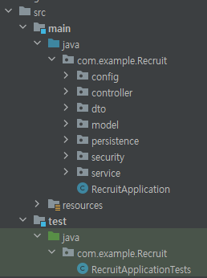

# 💁‍♂️ 1장 첫 번째 양파 껍질 벗기기

> 양파 껍질을 벗기듯이 학습하라

한 번에 한 가지 지식을 깊이 있게 학습하는 것에 집중하기 보다 다양한 분야의 얕은  지식을 습득한 후 일정 수준이 되면 다음 단계의 깊은 지식으로 서서히 깊이를 더해가라

## 1.1 대한민국 IT 개발자 직군의 종류

- 웹 백엔드 개발자 : 자바, C#, 루비, 파이썬 등의 언어로 서버 쪽의 로직을 개발한다. 대부분의 경우 데이터베이스도 잘 알아야 한다.


- 웹 프론트엔드 개발자 : HTML/CSS, 자바스크립트를 주로 사용하며 디자이너와 협업하는 개발자이다. 최근에는 jQuery, Angular.js, React.js와 같은 라이브러리도 잘 사용해야 하고, node.js를 통해 웹 백엔드 개발까지 가능하다.


- 모바일 앱 개발자 : 자바 기반의 안드로이드 개발자와 오브젝티브 C(또는 Swift) 기반의 iOS 개발자가 속한다.


- 기타 : 시스템 프로그래머, 모바일 게임 개발자, 게임 서버 및 게임 클라이언트 개발자가 있다.


- 비개발자 직군 : DBA, 시스템 엔지니어, 빅데이터 전문가가 있다. 

## 1.2 개발자들에게 유용한 웹사이트들

- google.com : 대표적인 검색엔진. 검색은 절대로 부끄러워 할 일이 아니고 개발자가 키워야 할 능력 중의 하나이다.

- stackoverflow.com : 개발자들의 지식인 같은 곳

- githum.com : 소셜 코딩이라고 부른다. Git의 사용법과 함께 필수적으로 알아야 한다.
    - Git : 소스코드에 대한 버전 관리용 도구
    - GitHub : Git을 지원하는 웹 서비스

- sideshare.net : 새로운 기술이 무엇인지 보고 싶을 때 우선적으로 검색을 권한다.

- trello.com : 칸반이라는 툴을 적용할 수 있는 도구. 프로젝트 관리를 위한 협업 도구.

## 1.3 처음에 배워야 하는 것들

- 맥 / 리눅스 사용법
- 다양한 프로그래밍 언어
- 내 전문 분야에 대한 방향성을 결정하자

## 1.4 일단 시작해 보자

코딩이라는 우리에게 필요한 작업은 머리와 손이 함께 배우는 부분이 많다. </br>반복이 매우 중요하기 때문에 아는거 또 나왔네? 라고 넘어가지 말고 반복해서 학습하자

- 안나, 엘사와 함께하는 코드(컴퓨터에서 중요한 기초 개념인 순차, 반복, 조건문의 개념) : http://code.org/learn
- 칸 아카데미의 컴퓨터 교육(자바스크립의 감) : https://www.khanacademy.org/computing/computer-programming

일단 무엇인가 만들어보는 경험을 한 후 이론적인 개념을 학습하고,</br> 다시 다음 단계의 경험을 하고 이론적인 개념을 학습하는 과정을 반복하는 것이 중요하다. 

## 1.5 본격적으로 웹 프로그래밍에 도전하기
### 1.5.1 온라인 강의를 통한 학습
https://opentutorials.org/course/1688 : 생활코딩/PHP기반 웹 어플리케이션 개발의 전체 흐름 이해
https://www.codecademy.com/learn : 웹 어플리케이션 개발에 대한 지식을 각 지식별로 학습할 수 있다.
http://www.w3schools.com/: codecademy와 같이 병행해 학습할 수 있는 곳으로 프론트엔드 지식을 학습할 수 있다.

### 1.5.2 책을 통한 학습

자신의 현재 수준과 맞고, 자신이 선호하는 스타일과 맞는 책이 좋은 책이다.</br>
프로가 되기 위한 웹 기술 입문 : 웹 애플리케이션 개발에 대한 기본적인 용어와 흐름을 이해하는데 좋다.

</br>
웹 프론트엔드 학습</br>
자바스크립트 & 제이쿼리: 인터랙티브 프론트엔드 웹 개발 교과서 : 프로그래밍을 처음 시작하는 개발자가 읽어도 괜찮은 책.</br> HTML, CSS, 자바스크립트 기초 지식에 대해서 다룬다.
웹 표준 가이드 : HTML5+CSS3, 자바스크립트를 말하다 : 가장 간결하면서도 완벽한 자바스크립트 입문서

</br>

웹 백엔드 학습</br>
열혈강의 자바 웹 개발 워크북 - MVC 아키텍처, 마이바티스, 스프링으로 만드는 실무형 개발자 로드맵 :</br> 서블릿, JSP에서부터 시작해 스프링 프레임워크까지 자바 웹 애플리케이션 개발 전반에 대해 따라하기 식으로 구성되어 있다.</br>
SQL 첫걸음 : 하루 30분 36강으로 배우는 완전 초보의 SQL 따라잡기

</br>
모르는 내용이 많더라도 일단 무엇인가를 만드는 경험을 해보자
일단 시작하지 않으면 내가 무엇을 모르는지조차 모른다.

### 1.6 학습 방법

첫 번째 단계, 필요한 부분부터 흡수한다.</br>
두 번째 단계, 대략적인 부분을 잡아서 조금씩 상세화한다.</br>
세 번째 단계, 끝에서부터 차례대로 베껴간다.

## 💁‍♀️ 2장. 문자열 계산기 구현을 통한 테스트와 리팩토링
## 2.1 main() 메소드를 활용한 테스트의 문제점

사칙 연산 계산기 구현 코드
```java
public class Calculator{
    int add(int i, int j){
        return i+j;
    }
    int subtract(int i, int j){
        return i-j;
    }
    int multiply(int i, int j){
        return i*j;
    }
    int divide(int i, int j){
        return i/j;
    }
    public static void main(String[] args) {
        Calculator cal = new Calculator();
        System.out.println(cal.add(3, 4));
        System.out.println(cal.subtract(5, 4));
        System.out.println(cal.multiply(2, 6));
        System.out.println(cal.divide(8, 4));
    }
}
```

서비스를 담당하는 프로덕션 코드와</br>
이 프로덕션 코드가 정상적으로 동작하는지 확인하기 위한 main()으로 나뉜다.</br>
main()의 목적을 테스트로 생각해 테스트 코드라고 부르겠다.

위 코드의 문제점은 프로덕션 코드와 테스트 코드가 같은 클래스에 위치하고 있다는 것이다.</br>
테스트 코드의 경우 테스트 단계에서만 필요하기 때문에 서비스하는 시점에 같이 배포할 필요가 없다.

```java
public class CalculatorTest{
    public static void main(String[] args) {
        Calculator cal = new Calculator();
        System.out.println(cal.add(9,3));
        System.out.println(cal.substract(9,3));
        System.out.println(cal.multiply(2, 6));
        System.out.println(cal.divide(8, 4));
    }
}
```

테스트를 담당하는 별도의 클래스를 추가했지만 main() 메소드 하나에서 프로덕션 코드의 여러 메소드를 동시에 테스트하고 있다.</br>
이는 프로덕션 코드의 복잡도가 증가하면 증가할수록, main() 메소드의 복잡도가 증가하고, 결과적으로 main() 메소드를 유지하는데 부담이 된다.

```java
public class CalculatorTest{
    public static void main(String[] args) {
        Calculator cal = new Calculator();
        add(cal);
        substract(cal);
        multify(cal);
        divide(cal);
    }

    private static void divide(Calculator cal) {
        System.out.println(cal.divide(8,4));
    }
    private static void multiply(Calculator cal) {
        System.out.println(cal.multiply(2,6));
    }
    private static void subtract(Calculator cal) {
        System.out.println(cal.subtract(5,4));
    }
    private static void add(Calculator cal) {
        System.out.println(cal.add(3,4));
    }
}
```

하지만, 우리는 프로그래밍할 때 한 번에 메소드 하나의 구현에 집중한다.</br>
현재 내가 구현하고 있는 메소드에만 집중하고 싶다.</br>
하지만, 위 테스트 코드는 Calculator 클래스가 가지고 있는 모든 메소드를 테스트할 수 밖에 없다.</br>
또, 테스트 결과를 매번 콘솔에 출력되는 값을 통해 수동으로 확인해야 한다는 것이다.</br>

이와 같은 문제점을 해결하기 위해 등장한 라이브러리가 JUnit이다.</br>
JUnit은 내가 관심을 가지는 메소드에 대한 테스트만 가능하다.</br>
또한 로직을 실행한 후의 결과 값 확인을 프로그래밍을 통해 자동화하는 것이 가능하다.

## 2.2 JUnit을 활용해 main() 메소드 문제점 극복

JUnit은 main() 메소드의 한계를 해결해줄 수 있는 단위 테스트 프레임워크 중 하나이다.

### 2.2.1 한 번에 메소드 하나에만 집중

JUnit 라이브러리를 추가한 후 main() 메소드로 구현한 CalculatorTest를 삭제하고 새로운 CalculatorTest를 추가한다.

테스트 메소드에 @Test 애노테이션을 추가한다.

```java
import static org.junit.Assert.assertEquals;
import org.junit.Test;

public class CalculatorTest {

    @Test
    public void add() {
        Calculator cal = new Calculator();
        System.out.println(cal.add(6, 3));
    }

    @Test
    public void subtract() {
        Calculator cal = new Calculator();
        System.out.println(cal.substract(6, 3));
    }
}
```

위와 같이 전체 메소드를 한번에 실행할 수도 있으며, add(), substract() 메소드 각각을 실행할 수도 있다.</br>
이와 같이 각각의 테스트 메소드를 독립적으로 실행할 수 있기 때문에 다른 메소드에 영향을 받지 않고 내가 구현하고 있는 프로덕션 코드에 집중할 수 있는 효과를 얻을 수 있다.

### 2.2.2 결과 값을 눈이 아닌 프로그램을 통해 자동화

main() 메소드의 두 번째 문제점은 실행 결과를 눈으로 직접 확인해야 한다는 것이다.</br>
이 문제점을 극복하기 위해 JUnit은 assertEquals() 메소드를 제공한다.

```java
import static org.junit.Assert.assertEquals;
import org.junit.Test;

public class CalculatorTest {

    @Test
    public void add() {
        Calculator cal = new Calculator();
        assertEquals(9, cal.add(6,3));
    }

    @Test
    public void subtract() {
        Calculator cal = new Calculator();
        assertEquals(3, cal.subtract(6,3));
    }
}
```

assertEquals는 static 메소드라 import static으로 메소드를 import한다.</br>
assertEquals() 메소드의 첫 번째 인자는 기대하는 결과 값(expected)이고,</br>
두 번째 인자는 프로덕션 코드의 메소드를 실행한 결과 값(actual)이다.</br>
assertEquals() 메소드는 int, long, String 등 다양한 데이터 타입 지원이 가능하다.</br>
JUnit의 assertEquals() 메소드를 활용하면 지금까지 수동으로 확인 했던 실행 결과를 자동화하는 것이 가능하다.

assertEquals() 메소드 이외에도 결과 값이 true/false 인지를 확인할 수 있는 assertTrue(), assertFalse() 메소드,</br>
결과 값이 null 유무를 판단할 수 있는 assertNull(), assertNotNull(),</br>
배열 값이 같은지를 검증하는 assertArrayEquals() 메소드를 제공한다.

### 2.2.3 테스트 코드 중복 제거

개발자가 가져야 할 좋은 습관 중의 하나는 중복 코드를 제거하는 것이다.

```java
public class CalculatorTest {
    private Calculator cal = new Calculator();

    @Test
    public void add() {
        assertEquals(9, cal.add(6,3));
    }

    @Test
    public void subtract() {
        assertEquals(3, cal.subtract(6,3));
    }
}
```

하지만, JUnit은 @Before 애노테이션을 활용해 다음과 같이 구현할 것을 추천한다.
```java
import static org.junit.Assert.assertEquals;

import org.junit.Before;
import org.junit.Test;

public class CalculatorTest {
    private Calculator cal;

    @Before
    public void setup() {
        cal = new Calculator();
    }

    @Test
    public void add() {
        assertEquals(9, cal.add(6,3));
    }

    @Test
    public void subtract() {
        assertEquals(3, cal.subtract(6,3));
    }
}
```

@Before 애노테이션을 사용하지 않고 필드로 구현하는 방법 모두 각 단위 테스트를 실행할 때마다 Calculator 인스턴스를 생성하는 것은 같다.</br>
이와 같이 Calculator 인스턴스를 매 테스트마다 생성하는 이유는 add() 테스트 메소드를 실행할 때 Calculator의 상태 값이 변경되어 다음 테스트 메소드인 subtract() 메소드를 실행할 때 영향을 미칠 수 있기 때문이다.</br>
JUnit에는 @RunWith, @Rule 같은 애노테이션을 사용해 기능을 확장할 수 있는데,</br> @Before안이어야만 @RunWith, @Rule에서 초기화된 객체에 접근할 수 있다.

이렇게 @Before을 통해 초기화 작업을 하듯이 @After 애노테이션을 통해 메소드 실행이 끝난 후 실행됨으로써 후처리 작업을 담당한다.
```java
import org.junit.After;
import org.junit.Before;
import org.junit.Test;

import static org.junit.Assert.assertEquals;

public class CalculatorTest {

    private Calculator cal;

    @Before
    public void setup() {
        cal = new Calculator();
        System.out.println("Before");
    }

    @Test
    public void add() {
        assertEquals(9, cal.add(6, 3));
        System.out.println("add");
    }

    @Test
    public void subtract() {
        assertEquals(3, cal.subtract(6, 3));
        System.out.println("subtract");
    }

    @After
    public void teardown() {
        System.out.println("teardown");
    }
}
```

실행결과는 다음과 같다.
> Before  
> subtract  
> teardown  
> Before  
> add  
> teardown

각 테스트 메소드가 실행될 때마다 @Before, @After 애노테이션으로 설정한 메소드가 실행된다.</br>
=> 각 테스트 간에 영향을 미치지 않고 독립적인 실행이 가능하다.

## 2.3 문자열 계산기 요구사항 및 실습
### 2.3.1 요구사항
문자열 계산기의 요구사항은 전달하는 문자를 구분자로 분리한 후 각 숫자의 합을 구해 반환해야 한다.
- 쉼표(,) 또는 콜론(;)을 구분자로 가지는 문자열을 전달하는 경우 구분자를 기준으로 분리한 각 숫자의 합을 반환
    - ex) " " -> 0, "1,2" -> 3, "1,2,3," -> 6, "1,2:3" -> 6
- 앞의 기본 구분자(쉼표, 콜론) 외에 커스텀 구분자를 지정할 수 있다. 커스텀 구분자는 문자열 앞부분의 "//"와 "\n" 사이에 위치하는 문자를
  커스텀 구분자로 사용한다. 예를 들어 "//;\n1;2;3"과 같이 값을 입력할 경우 커스텀 구분자는 세미콜론(;)이며, 결과 값은 6이 반환되어야 한다.
- 문자열 계산기에 음수를 전달하는 경우 RuntimeException으로 예외 처리한다.

곧바로 구현을 시작하기보다 구현을 시작하기 전에 작은 단위로 나누는 연습을 하는 것이 개발자의 역량을 키우기 위한 좋은 연습이다.</br>

### 2.3.2 요구사항 분리 및 각 단계별 힌트
테스트 클래스 이름은 프로덕션 클래스 이름에 Test 접미사를 붙이는 것이 관례이다</br>
프로덕션 코드와 테스트 코드를 구현하기 위해 클래스를 분리할 뿐만 아니라 최초 소스코드를 관리하는 디렉토리까지 분리한다.



StringCalculator 클래스는 다음과 같은 메소드 구조를 가질 것이다.

```java
public class StringCalculator {
    int add(String text) {
        return 0;
    }
}
```
빈 문자열 또는 null 값을 입력할 경우 0을 반환해야 한다. (""=> 0, null=> 0)
```java
if(text ==null){}
if(text.isEmpty()){}
```
숫자 하나를 문자열로 입력할 경우 해당 숫자를 반환한다. ("1" =>1)
```java
int number = Integer.parseInt(text);
```
숫자 두개를 쉼표(,) 구분자로 입력할 경우 두 숫자의 합을 반환한다("1,2" => 3)
```java
String[] numbers = text.split(",");
```
구분자를 쉼표(,) 이외에 콜론(:)을 사용할 수 있다.("1,2:3" => 6)
```java
String[] tokens = text.split(",|:");
```
"//"와 "\n" 문자 사이에 커스텀 구분자를 지정할 수 있다. ("//;\n1;2;3" =>6)
```java
Matcher m = Pattern.compile("//(.)\n(.*)").matcher(text);
if(m.find()){
    String customDelimeter = m.group(1);
    String[] tokens = m.group(2).split(customDelimeter);
}
```
### 2.3.3 추가 요구사항
소스코드를 구현했으면 반드시 뒤따라야 하는 과정이 중복을 제거하고, 읽기 좋은 코드를 구현하기 위해 구조를 변경하는 리팩토링이다.</br>
리팩토링이란 소스코드의 가독성을 높이고 유지보수를 편하게 하기 위해 소스코드의 구조를 변경하는 것을 의미한다.</br>
다음 요구사항에 맞춰 리팩토링을 진행한다.
- 메소드가 한 가지 책임만 가지도록 구현한다.
- 인덴트(indent, 들여쓰기) 깊이를 1단계로 유지한다. 다음 소스코드의 인덴트 깊이는 2이다.
```java
void someMethod(){
    while(true){
        if(true){
            
        }    
    }
}
```
- else를 사용하지 마라. 프로그래밍을 구현할 때 else를 사용하지 않고 프로그래밍하는 것이 가능하다.</br>
  최대한 지키려고 노력해보면 좀 더 깔끔한 코드를 구현할 수 있을 것이다.

## 2.4 테스트와 리팩토링을 통한 문자열 계산기 구현
### 2.4.4 문자열 계산기 구현
#### 2.4.4.1 빈 문자열 또는 null 값을 입력할 경우 0을 반환해야 한다.
테스트 코드
```java
import org.junit.jupiter.api.BeforeEach;
import org.junit.jupiter.api.Test;

import static org.junit.jupiter.api.Assertions.*;

class StringCalculatorAnswerTest {

    private StringCalculatorAnswer sc;

    @BeforeEach
    void setUp() {
        sc = new StringCalculatorAnswer();
    }

    @Test
    void add_null_또는_빈문자() {
        assertEquals(0, sc.add(null));
        assertEquals(0, sc.add(""));
    }
}
```
구현 코드
```java
public class StringCalculatorAnswer {
    public int add(String text) {
        if (text == null || text.isEmpty()) {
            return 0;
        }
        return 0;
    }
}
```
테스트 메소드 이름에 한글을 사용할 수 있다.
#### 2.4.4.2 숫자 하나를 문자열로 입력할 경우 해당 숫자를 반환한다.
테스트 코드
```java
@Test
public void add_숫자하나() throws Exception {
    assertEquals(1, sc.add("1"));
}
```
구현 코드
```java
public class StringCalculatorAnswer {
    public int add(String text) {
        if (text == null || text.isEmpty()) {
            return 0;
        }
        return Integer.parseInt(text);
    }
}
```
#### 2.4.4.3 숫자 두개를 쉼표(,) 구분자로 입력할 경우 두 숫자의 합을 반환한다.

테스트 코드
```java
    @Test
    public void add_쉼표구분자() throws Exception {
        assertEquals(3, sc.add("1,2"));
    }
```
구현 코드
```java
public class StringCalculatorAnswer {
    public int add(String text) {
        if (text == null || text.isEmpty()) {
            return 0;
        }

        if (text.contains(",")) {
            String[] values = text.split(",");
            int sum = 0;
            for (String value : values) {
                sum += Integer.parseInt(value);
            }
            return sum;
        }

        return Integer.parseInt(text);
    }
}
```
else문을 사용하지 않고 구현했다.</br>
숫자가 하나인 경우와 쉼표 구분자를 포함하는 경우를 따로 분기해서 처리해야 한다는 점이다.</br>
String의 split() 메소드에 숫자 하나를 가지는 문자열을 전달하면 숫자 하나가 담겨 있는 String[]을 반환하면 이 부분의 분기문을 제거할 수 있다.

테스트 코드
```java
    @Test
    public void split() {
        assertArrayEquals(new String[] {"1"}, "1".split(","));
        assertArrayEquals(new String[] {"1", "2"}, "1,2".split(","));
    }
```
구현 코드
```java
public class StringCalculatorAnswer {
    public int add(String text) {
        if (text == null || text.isEmpty()) {
            return 0;
        }

        String[] values = text.split(",");
        int sum = 0;
        for (String value : values) {
            sum += Integer.parseInt(value);
        }

        return sum;
    }
}
```

add() 메소드를 분리할 수 없을까를 고민하다가 숫자의 합을 구하는 부분을 별도의 메소드로 분리할 수 있을 것 같다.
```java
public class StringCalculatorAnswer {
    public int add(String text) {
        if (text == null || text.isEmpty()) {
            return 0;
        }

        String[] values = text.split(",");
        return sum(values);
    }

    private int sum(String[] values) {
        int sum = 0;
        for (String value : values) {
            sum += Integer.parseInt(value);
        }
        return sum;
    }
}
```

sum 메소드가 숫자 배열의 합을 구하는 일 뿐만 아니라 배열을 숫자로 변환하는 작업도 하고 있다.</br>
따라서 메소드는 한 가지 책임만 가져야 한다는 원칙에 따라 이 두 가지 작업을 분리한다.
```java
public class StringCalculatorAnswer {
    public int add(String text) {
        if (text == null || text.isEmpty()) {
            return 0;
        }

        String[] values = text.split(",");
        return sum(toInts(values));
    }

    private int[] toInts(String[] values) {
        int[] numbers = new int[values.length];
        for (int i = 0; i < values.length; i++) {
            numbers[i] = Integer.parseInt(values[i]);
        }
        return numbers;
    }

    private int sum(int[] numbers) {
        int sum = 0;
        for (int number : numbers) {
            sum += number;
        }
        return sum;
    }
}
```

한번 더 리팩토링할 수 있다고 한다;;
```java
public class StringCalculatorAnswer {
    public int add(String text) {
        if (isBlank(text)) {
            return 0;
        }

        return sum(toInts(split(text)));
    }

    private boolean isBlank(String text) {
        return text == null || text.isEmpty();
    }

    private String[] split(String text) {
        return text.split(",");
    }
    
    [..]
}
```
이렇게 극단적으로 리팩토링한 이유는 소스코드를 읽을 때 이 메소드가 무슨 일을 하는 메소드인지 최대한 쉽게 파악할 수 있도록 하기 위함이다.</br>
세부 구현은 모두 private 메소드로 분리해 일단 관심사에서 제외하고 add() 메소드가 무슨 일을 하는지에 대한 전체 흐름을 쉽게 파악할 수 있어야 한다.</br>
add 메소드는 "결국 text 값이 비어 있으면 0을 반환, 비어 있지 않으면 구분자로 분리, 숫자로 변환한 다음 이 숫자의 합을 구한다." 라고 파악할 수 있다.

#### 2.4.4.4 구분자를 쉼표(,) 이외에 콜론(:)을 사용할 수 있다.
테스트 코드
```java
    @Test
    public void add_쉼표_또는_콜론_구분자() throws Exception {
        assertEquals(6, sc.add("1,2:3"));
    }
```
구현 코드
```java
public class StringCalculatorAnswer {
    public int add(String text) {
        if (isBlank(text)) {
            return 0;
        }

        return sum(toInts(split(text)));
    }
    
    [...]

    private String[] split(String text) {
        return text.split(",|:");
    }
    
    [...]
}
```
메소드를 잘 분리해 놓으면 새로운 요구사항이 발생할 경우 해당 메소드를 찾아 해당 메소드만 수정사항을 반영하는 것이 가능하다.
#### 2.4.4.5 "//"와 "\n" 문자 사이에 커스텀 구분자를 지정할 수 있다.
테스트 코드
```java
    @Test
public void add_custom_구분자() throws Exception {
        assertEquals(6, sc.add("//;\n1;2;3"));
        }
```
구현 코드
```java
import java.util.regex.Matcher;
import java.util.regex.Pattern;

public class StringCalculatorAnswer {
    public int add(String text) {
        if (isBlank(text)) {
            return 0;
        }

        return sum(toInts(split(text)));
    }

    [...]

    private String[] split(String text) {
        Matcher m = Pattern.compile("//(.)\n(.*)").matcher(text);
        if (m.find()) {
            String customDelimiter = m.group(1);
            return m.group(2).split(customDelimiter);
        }

        return text.split(",|:");
    }

    [...]
}

```

정규식 표현을 활용하면 복잡한 문자열에서 원하는 문자열을 찾거나 특정한 패턴을 찾는 데 유용하다.

#### 2.4.4.6 문자열 계산기에 음수를 전달하는 경우 RuntimeException 예외를 throw한다.
테스트 코드
```java
    // 책과 테스트 코드가 다른 것은 JUnit 버전이 다르기 때문이다.
    @Test
    public void add_negative() throws Exception {
        assertThrows(RuntimeException.class, () -> sc.add("-1,2,3"));
    }
```
구현 코드
```java
import java.util.regex.Matcher;
import java.util.regex.Pattern;

public class StringCalculatorAnswer {
    public int add(String text) {
        if (isBlank(text)) {
            return 0;
        }

        return sum(toInts(split(text)));
    }

    [...]

    private int[] toInts(String[] values) {
        int[] numbers = new int[values.length];
        for (int i = 0; i < values.length; i++) {
            numbers[i] = toPositive(values[i]);
        }
        return numbers;
    }

    private int toPositive(String value) {
        int number = Integer.parseInt(value);
        if (number < 0) {
            throw new RuntimeException();
        }
        return number;
    }

    [...]
}
```

요구사항이 변경되면서 메소드 이름, 변수 이름을 변경하는 것 또한 중요한 리팩토링이다.

구현 => 테스트를 통해 결과 확인 => 리팩토링으로 진행

## 2.5 추가 학습 자료
### 2.5.1 테스트 주도 개발(Test Driven Development, 이하 TDD)과 리팩토링
