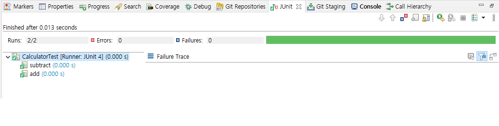

# 1장 첫 번째 양파 껍질 벗기기
## 1.1 대한민국 IT 개발자 직군의 종류
- 웹 백엔드 개발자
- 웹 프론트엔드 개발자
- 모바일 앱 개발자
- 기타(시스템 프로그래머, 모바일 게임 개발자, 서버 및 클라이언트 개발자)
- 비개발자 직군(DBA, 시스템 엔지니어, 빅데이터 전문가)
## 1.2 개발자들에게 유용한 웹사이트들
- [Google](https://www.google.com) : 검색엔진
- [Stackoverflow](https://www.stackoverflow.com) : 개발자에게 질의를 할 수 있는 사이트
- [Github](https://github.com) : 코드 및 readme를 통한 기술 공유 사이트
- [Slideshare](https://slideshare.net) : 발표 자료를 통해 정보를 얻을 수 있는 사이트
- [Trello](https://trello.com) : 협업/프로젝트 관리를 위한 사이트
## ETC
- [Figma](https://figma.com) : 디자인 구체화를 위한 무료 디자인 툴 사이트
- [Redmine](https://www.redmine.org) : 협업/프로젝트 관리를 위한 사이트, 옛날 회사에서 많이 쓰던 관리 툴이라고 함
- [Notion](https://www.notion.so/ko-kr) : 협업/프로젝트 관리를 위한 사이트
- [W3Schools](https://www.w3schools.com/) : 다양한 웹관련 기술의 사용법을 예제와 함께 쉽게 공부할 수 있는 사이트
- [LOGO](https://logo.com/) : 무료 AI 로고 자동 생성 사이트
## 1.3 처음에 배워야 하는 것들
- 맥/ 리눅스 사용법
- 다양한 프로그래밍 언어<br>
웹 개발자 -> 자바스크립트, Ruby<br>
모바일 개발자 -> Swift, Objective-c<br>
함수형 프로그래밍 언어 : Scala, Haskell, Rust
- 전문 방향성 결정 
## ETC
1. Objective-c는 현재 Swift로 대부분 넘어갔다.
2. Ruby는 Ruby on Rails라는 프레임워크가 Ruby기반인데 유럽/미국에서의 인지도가 국내의 스프링 위치에 해당될 정도로 인기가 많다. 
* 국내 Ruby on Rails기반 서비스
    * 잡플래닛
    * 당근마켓
    * 왓챠
    * 업비트
## 1.4 일단 시작해 보자
- [안나, 엘사와 함께하는 코드](https://studio.code.org/s/frozen/lessons/1/levels/1) : 기초적인 코딩에 대한 감을 잡게 해주는 사이트
- [칸 아카데미의 컴퓨터 교육](https://ko.khanacademy.org/computing/computer-programming) : 자바스크립트/html/css에 관한 튜토리얼 사이트
## 1.5 본격적으로 웹 프로그래밍에 도전하기
### 1.5.1 온라인 강의를 통한 학습
- [생활코딩](https://opentutorials.org/course/1) : PHP 기반 웹 어플리케이션 개발 교육 하이트
- [Codecademy](https://www.codecademy.com/) : 프로그래밍 언어 튜토리얼 사이트
- [W3Schools](https://www.w3schools.com/) : 다양한 웹관련 기술의 사용법을 예제와 함께 쉽게 공부할 수 있는 사이트
### 1.5.2 책을 통한 학습
* 프론트엔드
    - 프로가 되기 위한 웹 기술 입문
    - 자바스크립트 & 제이쿼리 : 인터랙티브 프론트엔드 웹 개발 교과서
    - 웹 표준 가이트 : HTML5 + CSS3
* 백엔드
    - 열혈강의 자바 웹 개발 워크북
    - SQL 첫걸음 : 하루 30분 36강으로 배우는 완전 초보의 SQL 따라잡기
##  1.6 학습방법
1. 필요한 부분 부터 흡수
2. 대략적인 부분을 잡아서 상세화
3. 끝에서 부터 차례대로 베끼기

# 2장 문열 계산기 구현을 통한 테스트와 리팩토링
## 2.1 main()메소드를 활용한 테스트의 문제점
계산기 코드 
 ```java
 public class Calculator {
    public int add(int i, int j) {
         return i + j;
     }
 
     public int subtract(int i, int j) {
         return i - j;
     }
 
     public int multiply(int i, int j) {
         return i * j;
     }
 
     public int divide(int i, int j) {
         return i / j;
     }
 }
public static void main(String[] args) {
    Calculator cal = new Calculator();
    System.out.println(cal.add(3, 4));
    System.out.println(cal.subtract(5, 4));
    System.out.println(cal.multiply(2, 6));
    System.out.println(cal.divide(8, 4));
}
 ```
테스트 코드 
 
 ```java
ublic class CalculatorTest {
    public static void main(String[] args) {
        Calculator cal = new Calculator();

        System.out.println(cal.add(3,4));
        System.out.println(cal.subtract(5,4));
        System.out.println(cal.multiply(2,6));
        System.out.println(cal.divide(8,4));
    }
}
```

단점 
1. 한가지의 메소드를 테스트하고 싶어도 모든 메소드를 테스트해야함
2. main메소드를 지속적으로 수정해야 되서 개방-폐쇄의 원칙 위배
## 2.2 JUnit을 활용해 main() 메소드 문제점 극복
> JUnit : AOP개념을 활용해 단위(메소드)로 테스팅을 할 수 있도록 해주는 테스트 프레임워크

### ETC
현재 최신 버전은 Junit5<br>
버전 별 기능적 차이는 거의 없고 문법적, 성능적 차이가 존재<br>
예제는 기존 프로젝트와 JUnit 3의 버전 충돌로 인해 JUnit 4로 진행함

### 2.2.1 한번에 메소드 하나에만 집중
JUnit을 반영한 테스트 코드
```java
import org.junit.Test;

public class CalculatorTest {
    @Test
    public void add() {
        Calculator cal = new Calculator();
        System.out.println(cal.add(6, 3));
    }

    @Test
    public void subtract() {
        Calculator cal = new Calculator();
        System.out.println(cal.subtract(6, 3));
    }
}
```
장점 : main에 종속적이었던 테스트 코드 부분을 제거<br>
단점 : 콘솔로 결과를 직접 확인해야함

### |2.2.1 결과 값을 눈이 아닌 프로그램을 통해 자동화
```
public class CalculatorTest extends Calculator {
	@Test
	public void add() {
		Calculator cal = new Calculator();
		assertEquals(9, cal.add(6, 3));
	}

	@Test
	public void subtract() {
		Calculator cal = new Calculator();
		assertEquals(3, cal.subtract(6, 3));
	}
}
```


콘솔이 아닌 JUnit 전용 프로퍼티에서 직관적으로 확인 가능

### 2.2.1 테스트 코드 중복 제거
```
public class CalculatorTest extends Calculator {
    private Calculator cal; // 계산기 객체 생성을 필드에서 진행하여 중복 코드 제거
	
	@Before //모든 @Test 메소드 실행 전 진행하는 메소드
	public void setup(){
	   cal = new Calculator();
	}
	
	@Test
	public void add() {
		assertEquals(9, cal.add(6, 3));
	}

	@Test
	public void subtract() {
		assertEquals(3, cal.subtract(6, 3));
	}
}
```

 ## 2.3 문자열 계산기 요구사항 및 실습
 ### 2.3.1 요구사항
 - :이나 , 구분자 사용시 모든 값의 합을 전달 ex) 2,3 -> 5
 - 커스텀 구분자를 //와 \n를 사용해 구현 가능 ex) ^구분자 -> \\^\n
 - 음수가 들어오면 RuntimeException 으로 예외처리
### 2.3.2 요구사항 분리 및 각 단계별 힌트
- 구분자 사용
split으로 분리
```
String [] numbers = text.split(",|:");
```
- 커스텀 구분자
 커스텀 구분자는 1번째에 지정되므로 정규식 사용
```
Matcher m = Pattern.compile("\\/\\/(.)\\\\n(.)*").matcher(str); // 패턴을 생성하고 문자열과 매칭
		if (m.find()) { //맞다면
			String customDelimeter = m.group(1); // 맨 앞에 있는 커스텀 구분자 선택
			String[] tokens = m.group(2).split(customDelimeter); //커스텀 구분자를 이용해 뒤의 그룹을 split
		}
```
- 음수
JUnit에서 throw exception으로 처리
### 2.3.3 추가 요구사항
- 한 메소드엔 한가지 책임만 갖도록 구현
- 들여쓰기는 1단계씩
- else 사용 기피
### ETC
> 코드 컨벤션(Convention) : 코딩을 진행할 때 지켜야 하는 규칙

[NHN 마크업 언어 코드 컨벤션](https://nuli.navercorp.com/data/convention/NHN_Coding_Conventions_for_Markup_Languages.pdf)
<br>
[네이버 자바 코드 컨벤션](https://naver.github.io/hackday-conventions-java)

**자주 쓰이는 코드 컨벤션**
- **변수 및 클래스 작명은 Camel 표기법을 준수**<br>
다양한 api가 Camel 표기법을 이용 ex) lombok, mybatis
- **클래스 시작은 대문자로, 메소드와 변수는 소문자로 시작**<br>
클래스와 변수/메소드 간의 차이를 분명하게 하기 위해
- **변수는 명사로, 메소드는 동사로 시작하여 작명**<br>
이름을 이용해 상태인지 동작인지 판단하기 쉽게하기 위해 명사와 동사를 이용해 구분
- **한줄이라도 if문은 중괄호를 사용**<br>
다중 if문인 경우 중괄호가 없는 것과 혼용되면 통일성이 떨어져 가독성 또한 떨어짐<br>
또한 테스팅은 조건문을 중심으로 진행하게 되는데 이때 해당 분기 확인을 위해 어차피 중괄호를 추가해야함
- **else는 최대한 적게 사용**<br>
else는 반대로 말하면 내가 다루지 않는 모든 경우의 수를 말하므로 어떤 경우에 실행하는 것인지 복기하기 어려워 디버깅이 어려워짐
- **들여쓰기는 한번만**<br>
들여쓰기의 횟수를 자유롭게하면 코드의 가독성이 떨어짐
- **한가지 영역의 조건은 한가지 if문에**<br>
여러가지 조건을 하나의 if문에 넣으면 디버깅이 어려워짐<br>
-> 오른쪽으로 길어지는 코드가 아래로 길어지는 코드보다 위험함

## 2.4 테스트와 리팩토링을 통한 문자열 계산기 구현
### 2.4.1 요구사항을 작은단위로 나누기
연습을 통해 요구사항을 단위로 나누는 실력을 올려야함
### 2.4.2 모든 단계의 끝은 리팩토링
리팩토링을 통해 코드의 복잡성을 낮추어야함
### 2.4.3 동영상을 통한 리팩토링
책의 리팩토링 과정을 영상으로 제공
<br>
[1단계](https://www.youtube.com/watch?v=08YYZ0acYNE&ab_channel=%EB%B0%95%EC%9E%AC%EC%84%B1)<br>
[2단계](https://www.youtube.com/watch?v=AAMap-pXXN4&ab_channel=%EB%B0%95%EC%9E%AC%EC%84%B1)<br>
[3단계](https://www.youtube.com/watch?v=weE5PVX9D60&ab_channel=%EB%B0%95%EC%9E%AC%EC%84%B1)


## 2.5 추가 학습 자료
### 2.5.1 테스트 주도 개발과 리팩토링
> TDD(Test Driven Development): 테스트 시나리오를 먼저 생성하고 이를 바탕으로 개발을 진행하는 개발론

안정적인 리팩토링은 견고한 테스트를 바탕으로 진행되어야 함
### ETC
**TDD 개발 사이클**<br>
설계 -> 테스트 시나리오 작성 -> 개발 -> 리팩토링

### 2.5.2 정규표현식
> 정규 표현식 : 문자열의 패턴을 표현하는 식

https://regexr.com/ 를 통해 학습 가능

### ETC
**정규표현식 자바 클래스**
- Pattern 
    * 정규표현식을 이용해 문자열 패턴에 만족하는지 값을 알려주는 클래스
    * 문자열 패턴을 이용해 패턴 생성
    * 문자열 전체가 맞는지 안맞는지 boolean 반환 메소드 지원
- Matcher
    * 정규표현식을 이용해 문자열 패턴에 만족하는지 값을 알려주는 클래스
    * 문자열 내부에서 맞는 부분 문자열이 있는지 알려줌
    * group 정규 표현식 지원
- String.match
    *  문자열 전체가 맞는지 안맞는지 boolean 반환 메소드 지원
    *  contains VS match
        -  contains는 포함이 되어있나 아닌가, match는 해당 패턴에 맞는가(equals) 

**자주 쓰이는 정규 표현식**
- . : 모든 문자열
- [0-9] : 모든 숫자
- [a-z] : 모든 소문자
- [A-Z] : 모든 대문자
- [a-zA-Z] : 모든 영문자
- [^0-9] : 숫자가 아닌 모든 문자

**도움이 되는 영상 및 사이트**<br>
[정규표현식, 더이상 미루지 말자](https://www.youtube.com/watch?v=t3M6toIflyQ&list=PLT9gaICC_WnqwpgUgxfdz-5AmHHXJcfX9&index=2&t=746s&ab_channel=%EB%93%9C%EB%A6%BC%EC%BD%94%EB%94%A9) : 정규표현식을 공부할 수 있는 20분 짜리 한국어 영상<br>
[Regexone](https://regexone.com/) : 정규표현식을 간단한 예제와 함께 공부할 수 있는 영문 사이트<br>
[Regex101](https://regex101.com): 정규표현식이 맞나 확인할 수 있는 사이트
